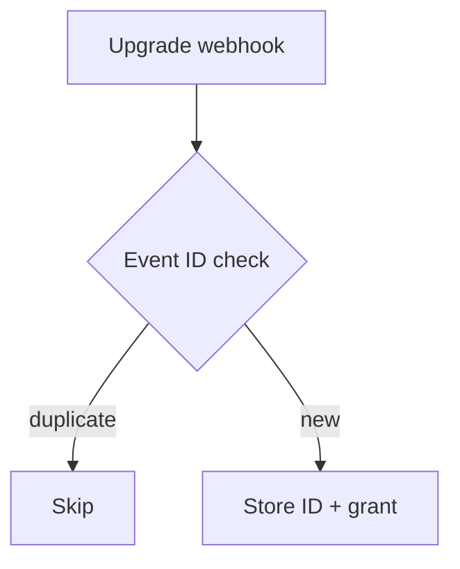

# PR descriptions

Write for a reviewer who has not opened the diff and the engineer who later finds the merge commit during an incident. Use ASD-STE100-inspired language, not a claim of formal STE compliance. The full standard includes a controlled dictionary; this skill adapts its clarity principles for software PRs. Repository-specific PR rules and explicit user instructions take precedence over these defaults.

## Establish the facts

1. Read the repository's PR guidance and template, the actual diff against the intended base, and any existing PR body. For a stack, inspect this layer against its parent, not the whole stack against main.
2. Read the originating issue and acceptance criteria through the available issue-tracker tooling. A ticket key in a branch name is a lead, not proof of scope or completion. If access fails, disclose that gap; do not invent ticket details.
3. Identify the problem, the changed behavior, who is affected, and any remaining work. Separate measured results from expected effects. Draft from the final diff, not the implementation plan or commit-message history.

## Language

- Use active voice and name the actor: “The worker retries the request,” not “Retries are performed.”
- Give each sentence one main idea. Aim for no more than 25 words; split longer sentences without losing conditions or exceptions.
- Use one term for one concept. Keep code identifiers, product names, and domain terms exact. Explain an unfamiliar term at first use instead of substituting an inaccurate everyday word.
- Prefer direct verbs: “use,” “start,” and “remove,” not “utilize,” “initiate,” or “perform the removal of.”
- State concrete behavior. Replace “improves reliability” with the failure this change prevents. Remove “This PR aims to,” “seamlessly,” and unsupported claims such as “robust” or “production-ready.”
- Make references unambiguous. Replace “this” or “it” with the relevant noun when two actors could fit. Preserve uncertainty when evidence is incomplete.

## Title and body

Use the repository's title convention; otherwise use `type(scope): concrete change`, omitting scope when it adds nothing. Keep a short action phrase, not a ticket title pasted verbatim. Preserve repository-specific revert formats.

Start the body with `<!-- created using pr-description -->`, unless repository tooling prescribes another watermark. Keep any required existing attribution.

The first visible content is a one- or two-sentence TLDR stating the change and its purpose. Aim for 25–40 words, with no heading. Move paths, size limits, implementation mechanics, and stack dependencies below it unless they are the change itself.

Most bodies should fit within 150 words, excluding diagrams, required tables, and evidence attachments; evidence prose still counts. Do not meet the word budget by packing more clauses into fewer paragraphs.

Place an optional diagram immediately after the TLDR. Omit it when the TLDR already explains the change; a command invocation and output-file inventory are not a flow diagram.

Add only context the diff cannot show: a consequential trade-off, exposure and rollout constraints, compatibility risk, a stack dependency, or reviewer-actionable evidence. Link measured results for performance claims. For UI changes, include before/after screenshots and an interaction recording when required by the repository. State missing evidence instead of claiming verification.

Do not add a file-by-file walkthrough, a commit diary, a checklist of commands, or a `## Test plan` section by default. Put necessary reproduction steps or manual setup in the prose. Mark unverified behavior as “Reviewer: confirm …”. Preserve required repository sections, such as feature-flag tables, with their exact schema. For long machine output, use a collapsed `<details>` block.

## Spacing and scanability

Use one topic per paragraph and one or two short sentences, usually 20–40 words. Split or trim any paragraph over 45 words. A one-sentence paragraph is welcome; do not merge it with another topic just to avoid a short block.

Insert a blank line between paragraphs and around headings, fenced diagrams, and screenshots. GitHub folds single source newlines into spaces: use blank lines for visible separation, not hard-wrapped prose or `<br>`. Keep each paragraph on one unwrapped source line.

After the TLDR and optional diagram, default to `## Evidence` and `## Merge Danger`. Add `## Scope` only when it needs a separate explanation. Keep sections short; report a verification gap rather than leaving Evidence empty. Preserve repository-required structure.

Keep rationale, stack dependencies, fallback behavior, and evidence in separate blocks. Put each reviewer instruction in its own paragraph. Use up to three short bullets for parallel cases or results instead of chaining them into a paragraph.

Cut implementation inventories and self-review chronology. Summarize the final behavior, not how each revision got there. Keep the strongest evidence link and its limitation visible; move detailed runs, sample counts, and machine output into `<details>` when they are still useful.

## Diagrams

Use a fenced `mermaid` diagram by default for GitHub PR bodies. Use a fenced `text` ASCII diagram only when the target does not render Mermaid or the user requests it. Show relationships, not an alternate prose description.

- Use at most five nodes with short labels of one to five words. Prefer a simple `flowchart TD`; use a sequence diagram when interaction order is the change.
- Prefer a vertical layout when a horizontal flow would need scrolling. Use simple node IDs and quoted labels; avoid custom styling and diagram features that require plugins.
- Keep arrow labels to a short condition or action, such as `new` or `retry`. Put commands, paths, flags, formats, limits, and caveats outside the chart. Retain an exact identifier only when it is needed to identify a boundary.
- Show the changed connection or label before/after when the difference would otherwise be unclear. For a knowledge change, show which information reaches which agent or decision. Do not draw the whole system or narrate every arrow again below it.

## Evidence

Show concrete before/after evidence of the changed behavior, not merely that CI is green. Prefer before/after screenshots for visual changes when the environment supports capture (S-tier); include recordings for interaction changes when useful or required. Otherwise use execution-based evidence (A-tier): a focused test, console output, or a measured run.

Name the exact test or scenario and its observed result before and after. Use brief, labeled pseudocode to explain the same case failing before the fix and passing afterward; link the real test or run. Pseudocode is an explanation, not execution evidence. Never invent runs, screenshots, or results. If either side was not run, state that gap and the reviewer action needed.

Follow repository evidence rules: when test output is excluded from PR bodies, use accepted behavioral evidence instead. Do not add tests solely to fill this section or bypass the repository's test policy. Keep long output in `<details>`.

## Merge Danger

State whether the change is a two-way door (cheap to roll back) or a one-way door (destructive or hard to reverse), and why. Name the rollback action and what it cannot undo. A code revert alone does not restore deleted data, reverse external effects, or guarantee compatibility with already-written state.

Describe the plausible blast radius: affected users, consumers, data, and deployment boundaries, plus important failure modes. For UI changes, consider layout shifts and mobile responsiveness; for APIs or shared code, consider downstream breakage and version skew. Explain containment such as a flag or limited rollout when present. Avoid an exhaustive hypothetical checklist or an unsupported “low risk.”

## Linear references

End the body with `## Linear` when a real ticket applies. Put one plain-text reference on each line:

| Reference            | Use when                                                    |
| -------------------- | ----------------------------------------------------------- |
| `Closes ABC-123`     | Merging this PR completes the ticket's acceptance criteria. |
| `Part of ABC-123`    | This PR advances the ticket, but work remains.              |
| `Related to ABC-123` | The ticket provides context; this PR does not complete it.  |

Verify each ticket and relationship. If completion is uncertain, do not use `Closes`. For a stack, intermediate layers use `Part of`; use `Closes` only on the PR whose merge completes the ticket. A merge into a stack branch is not necessarily completion on the target branch. Omit the section when no ticket applies; never insert a placeholder into a real PR.

These lines can drive Linear automation. Follow the repository's integration conventions; do not assume every repository maps keywords to the same status changes. Do not manually change Linear status or post a Linear comment just to accompany a PR description.

## Example

Illustrative only; the ticket and behavior must come from the actual task.

Title: `fix(billing): prevent duplicate credits on webhook retries`

<!-- created using pr-description -->

Prevent duplicate credit grants when Stripe retries an upgrade webhook. Store the event ID with each grant and skip events already processed.



## Scope

Existing grants remain unchanged. The event ID and credit grant are stored atomically so concurrent retries cannot both issue credits.

## Evidence

Before/after execution has not been captured. Reviewer: run the duplicate-delivery scenario against the base and head; confirm only one grant on head.

Illustrative pseudocode, not an executed result:

```text
deliver the same upgrade event twice concurrently
assert credit grant count == 1
```

## Merge Danger

Two-way door for code if the stored event ID remains compatible with the previous version. Reverting reopens duplicate-grant risk and cannot undo issued credits. The blast radius is upgrade-webhook credit grants.

## Linear

Closes BILL-123

## Before delivery

Before publishing, make a separate readability pass:

1. Count words per prose paragraph, including the TLDR and evidence. Split or trim blocks over 45 words; do not hide the same wall of text in one long bullet.
2. Scan only the TLDR, headings, and diagram labels. They should reveal the change and where to find its scope and evidence. Remove any diagram that adds no useful information.
3. Check Mermaid syntax and, when a preview is available, the rendered layout and arrow labels. Move inline explanations into prose or delete them. For an ASCII fallback, check width and box spacing.

Recheck the title, behavioral claims, diagram connections, evidence, rollback assumptions, blast radius, and ticket relationships against the latest diff. Remove stale claims after review changes. Preserve valid evidence and required sections when editing a body.

Drafting does not authorize publishing: use `gh` to create or edit a PR only when the user or active workflow authorizes it. After publishing, read back the title and body to verify blank-line separation, fences, and references.
